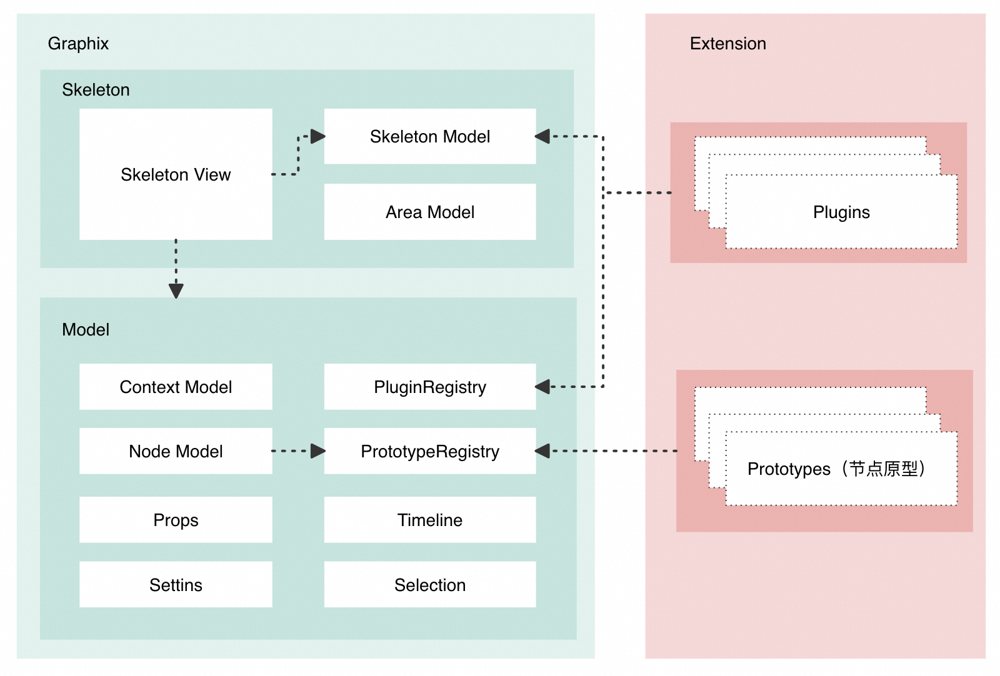

# Graphix
一个轻量级、可插拔、OOP 式图形编辑器开发引擎，旨在解决图形编辑器开发中的基础架构设计问题。

简体中文 | [English](./README.md)

## 🎬 Demo
- [example-x6-bpms](./examples/x6-bpms/)

- [example-threejs-3d](./examples/threejs-3d)


## ✨ 特性
- 💡 领域驱动设计：基于 TypeScript 的 OOP 式编辑器领域模型，提供完整的数据服务支持，包括撤销/重做机制和选区管理等功能。
- 🎨 用户界面：提供高度可定制的响应式视图框架 Skeleton View，以满足不同的界面需求。
- 🧩 可扩展架构：基于插件的体系结构允许无缝扩展编辑器功能，无需更改任何核心代码，使得功能增加更加灵活和便捷。

## 🔍 名词解释
| 名词         | 说明                                                       |
| ------------ | ---------------------------------------------------------- |
| 骨架（Skeleton） | Topbar，Toolbar，MainArea, LeftArea，RightArea  |
| 插件（Plugin）   | 通常用于扩展编辑器骨架各面板展示                                       |
| 原型（Prototype）| 节点原型配置，用于描述编辑器不同类型图形节点的 视图、属性设置器、默认属性值等等 |
| 设置器（Setting）| 用于描述图形节点的属性如何配置                                      |
| 图形渲染引擎       | 用于中心区域的图形画布渲染，常见 2d/3d 渲染库：Three.js, Babylon.js，Antv 系列，D3 等等 |

## 📚 设计
```ts
GraphView = GraphRender(GraphixModel)
```
Graphix 的设计来源于响应式数据驱动框架，确保模型的变化能够直接引导图形视图的渲染过程。简而言之，图形视图（GraphView）是由图形渲染器（GraphRender）根据 Graphix 模型的状态动态生成的。这种模型与渲染之间的绑定一旦确立，图形交互的逻辑就变得纯粹而高效——无需再涉足繁杂的渲染逻辑，只需专注于模型本身的操作。例如，要更新节点名称，开发者仅需调整 Graphix 节点的属性值即可。在这个协作环境中，即便是不熟悉图形渲染的开发者也能轻松参与。

其核心理念在于**把复杂的图形渲染逻辑问题转化成简单的模型数据结构问题**，从而围绕模型提供一套编辑器的基础架构设计方法。


### 编辑器模型
Graphix 的编辑器模型是基于节点（node-based）构建的，无论是 2d 场景下的 节点/边，还是 3d 下的 Mesh 之类的 Object3D，在 Graphix 中统一都被抽象描述成一个节点，Graphix 节点的数据结构描述本身也很简单：Id，类型以及对应节点属性 Props 构成一个节点。
```ts
interface NodeData {
  id?: string;
  type: string;
  props?: PropsData;
  [key: string]: any;
}
```
当 node-based 这个设计基调确定之后，Graphix 模型层便可以提供很多基于节点的能力：
1. Timeline 可以提供基础整体模型变化的撤销恢复服务。
2. Selection 可以提供节点选中的管理服务。
3. Prototype（原型）可以用来描述不同类型图形节点视图表示、属性配置界面以及默认属性值等。例如，在 Bpms 流程设计器中，UserTask（人工审批）节点作为一个特定类型，其原型不仅决定了节点的视觉呈现，还指定了用户选中该节点时属性设置面板的配置项以及该节点类型的默认属性集。这些描述性信息是高度通用的，为不同类型的图形节点提供了一个统一的定义框架。
4. ...等等

### Skeleton UI
大多数编辑器的整体 UI 设计基本相同，都会有对应的 Topbar 顶部栏，Toolbar 工具栏，MainArea 中心画布 ，RightArea 右侧设置面板等等，Graphix Skeleton 视图是响应式可扩展的，可以通过 skeleton 单例添加需要扩展的面板。
```ts
import { skeleton } from 'graphix-engine';

skeleton.add({
  area: 'topbar',
  content: <div>一个很帅的标题</div>
});
```

### Plugin 插件
插件的设计非常轻量化，插件的作用更多的是提供一种更好的组织代码的方式。当基于 Graphix 开发的编辑器产品本身需要面向 三方 提供扩展能力，那么使用插件去封装会很实用。
```ts
import { pluginRegistry } from 'graphix-engine';

pluginRegistry.register(() => {
  return {
    name: 'haha-plugin',
    init() {
      console.log('haha')
    }
  }
});
```

### JSON Schema
图形编辑器的本质就是通过可视化的方式编辑 JSON Schema
Graphix 的默认 Schema 如下，可以根据业务场景转成需要的结构。
```json
{
  "id": "d94bc0d46131c",
  "type": "Demo",
  "version": "1.0.0",
  "props": {},
  "nodes": [
    {
      "id": "1",
      "type": "mesh",
      "props": {
        "position": { "x": -20, "y": 0, "z": 20 },
        "size": { "width": 10, "height": 10, "depth": 10 }
      }
    }
  ]
}
```

## 🚀 快速开始
### Startup
Graphix 初始化启动的逻辑只有三步：
1. 把用于初始化的 json schema parse 成 Graphix 模型内存实例
2. 执行注册插件 init hook
3. 渲染 skeleton UI
```ts
import { init } from 'graphix-engine';

init({
  schema: {
    id: 'd94bc0d46131c',
    type: 'Demo',
    version: '1.0.0',
    // 全局属性
    props: {},
    // 节点集合
    nodes: [
      {
        id: '1',
        type: 'mesh',
        props: {
          position: { x: -20, y: 0, z: 20 },
          size: { width: 10, height: 10, depth: 10 },
        },
      },
    ],
  }
});
```

### Example
Graphix 与图形渲染无关，可以根据场景使用任意需要的图形渲染引擎，这里用 [threejs](https://github.com/mrdoob/three.js) 举 🌰。
```bash
npm install graphix-engine @types/three three --save-dev
```
```ts
// threejs scene.tsx
import React, { useCallback, useEffect, useRef } from 'react';
import * as THREE from 'three';
import { OrbitControls } from 'three/examples/jsm/controls/OrbitControls';
import { DragControls } from 'three/examples/jsm/controls/DragControls.js';
import { getContext } from 'graphix-engine';

const Scene = () => {
  const containerRef = useRef<HTMLDivElement>(null);
  const context = getContext();

  const init = useCallback((container) => {
    const scene = new THREE.Scene();
    const axesHelper = new THREE.AxesHelper(20);
    scene.add(axesHelper);

    const width = container.clientWidth;
    const height = container.clientHeight;

    const camera = new THREE.PerspectiveCamera(70, width / height, 0.1, 1000);
    camera.position.set(50, 50, 50);
    camera.lookAt(scene.position);

    const renderer = new THREE.WebGLRenderer({ antialias: true });
    renderer.setSize(width, height);
    container.appendChild(renderer.domElement);

    const controls = new OrbitControls(camera, renderer.domElement);
    controls.enableDamping = true;
    controls.dampingFactor = 0.25;
    controls.enableZoom = true;

    const nodes = context.getNodes();
    const meshes = nodes.map(n => {
      const { position, size } = n.getPropsData();
      const geometry = new THREE.BoxGeometry(size.width, size.height, size.depth);
      const material = new THREE.MeshBasicMaterial({ color: 0xffffff, wireframe: true });
      const mesh = new THREE.Mesh(geometry, material);
      mesh.position.set(position.x, position.y, position.z);
      mesh.userData.gid = n.getId();
      scene.add(mesh);
      return mesh;
    });

    const ambientLight = new THREE.AmbientLight(0x404040);
    scene.add(ambientLight);

    const dragControls = new DragControls(meshes, camera, renderer.domElement);
    dragControls.addEventListener('dragstart', (event) => controls.enabled = false);
    dragControls.addEventListener('dragend', (event) => controls.enabled = true);

    const raycaster = new THREE.Raycaster();
    const onMouseDown = (event: MouseEvent) => {
      const mouse = new THREE.Vector2();
      const rect = renderer.domElement.getBoundingClientRect();
      mouse.x = ((event.clientX - rect.left) / rect.width) * 2 - 1;
      mouse.y = -((event.clientY - rect.top) / rect.height) * 2 + 1;
      raycaster.setFromCamera(mouse, camera);

      let selected;
      for (const mesh of meshes) {
        const intersects = raycaster.intersectObject(mesh);
        if (intersects.length > 0) {
          selected = intersects[0].object;
          break;
        }
      }
      onSelect(selected);
    };

    const onSelect = (object?: THREE.Object3D) => {
      console.log("Selected object:", object);
      if (object) {
        context.getSelection().setKeys([object.userData.gid]);
      } else {
        context.getSelection().setKeys([]);
      }
    };
    container.addEventListener('mousedown', onMouseDown);
    const animate = () => {
      requestAnimationFrame(animate);
      controls.update();
      renderer.render(scene, camera);
    };
    animate();
    return () => {
      container.removeEventListener('mousedown', onMouseDown);
    };
  }, []);

  useEffect(() => {
    if (containerRef.current) {
      const dispose = init(containerRef.current);
      return dispose;
    }
  }, [init]);

  return (
    <div style={{ width: '100%', height: '100%' }} ref={containerRef} />
  );
};

export default Scene;
```
```ts
// index.ts
import { init, prototypeRegistry, skeleton } from 'graphix-engine';
import Scene from './scene';
import InputSetter from './setter/input-setter';

// 配置 mesh 类型节点设置器
prototypeRegistry.register({
  type: 'mesh',
  settings: [
    {
      target: 'data',
      setter: InputSetter
    }
  ]
});

skeleton.add({
  area: 'mainArea',
  content: Scene
});

init({
  schema: {
    id: 'd94bc0d46131c',
    type: 'Demo',
    version: '1.0.0',
    // 全局属性
    props: {},
    // 节点集合
    nodes: [
      {
        id: '1',
        type: 'mesh',
        props: {
          position: { x: -20, y: 0, z: 20 },
          size: { width: 10, height: 10, depth: 10 },
          data: 1
        },
      },
      {
        id: '2',
        type: 'mesh',
        props: {
          position: { x: 0, y: 0, z: 0 },
          size: { width: 10, height: 10, depth: 10 },
          data: 2
        },
      },
      {
        id: '3',
        type: 'mesh',
        props: {
          position: { x: 20, y: 0, z: -20 },
          size: { width: 10, height: 10, depth: 10 },
          data: '3'
        },
      },
    ],
  }
});
```

## 💻 本地调试

```bash
$ npm install
$ npm run bootstrap

// 选择合适的 demo 启动
$ npm run example-x6-bpms
$ npm run example-three
$ npm run example-reactflow
```

## 🤝 贡献

欢迎所有形式的贡献，无论是新功能，bug修复，文档改进或是其他类型的更新。

强烈推荐阅读 [《提问的智慧》](https://github.com/ryanhanwu/How-To-Ask-Questions-The-Smart-Way)、[《如何向开源社区提问题》](https://github.com/seajs/seajs/issues/545) 和 [《如何有效地报告 Bug》](http://www.chiark.greenend.org.uk/%7Esgtatham/bugs-cn.html)、[《如何向开源项目提交无法解答的问题》](https://zhuanlan.zhihu.com/p/25795393)，更好的问题更容易获得帮助。

关于提交 PR：
请将目标合并分支设置为 **develop**，不要指定 **main** 分支，在发布正式版本后，**develop** 分支将会合入  **main** 分支。

## 📄 许可证

Graphix 是在 MIT 许可证下发布的。有关详细信息，请阅读许可证文件。