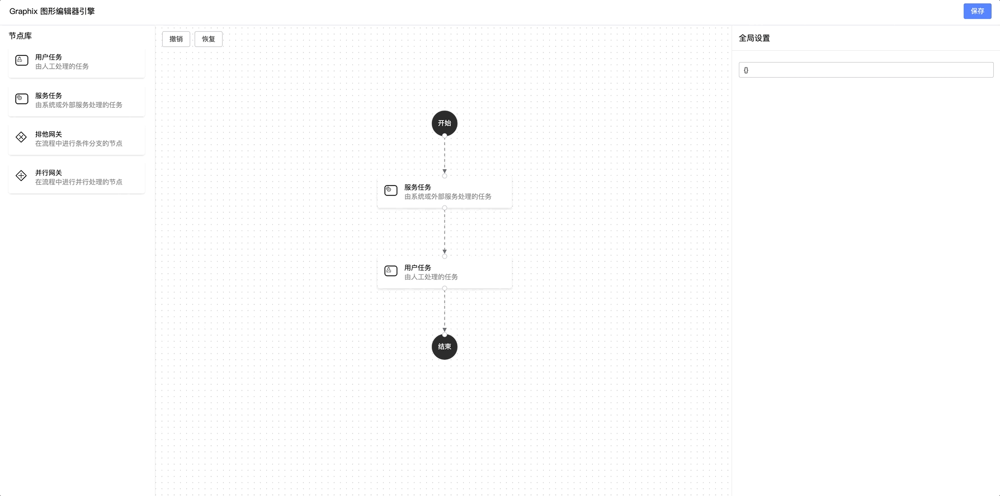
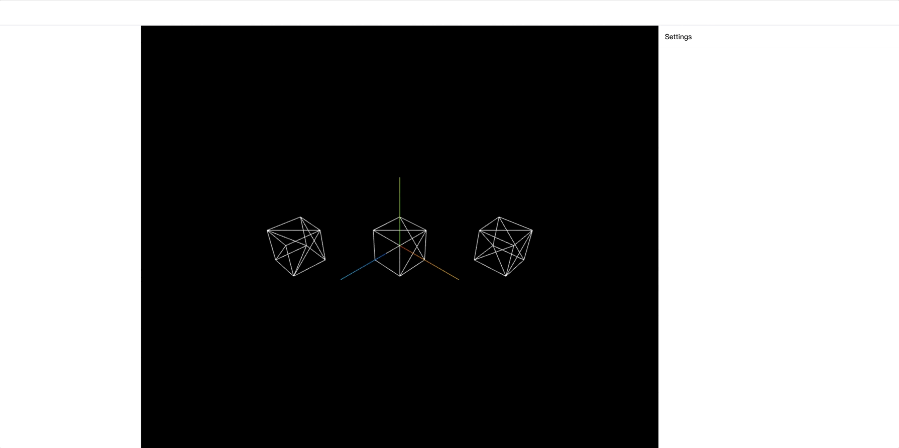
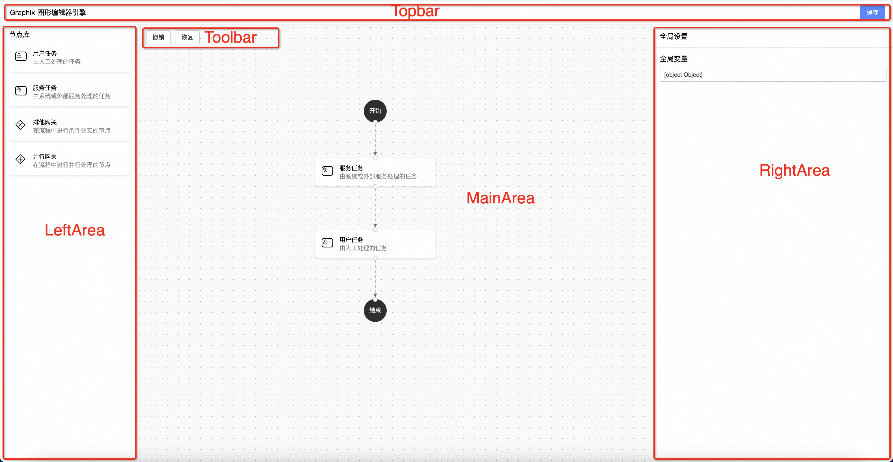
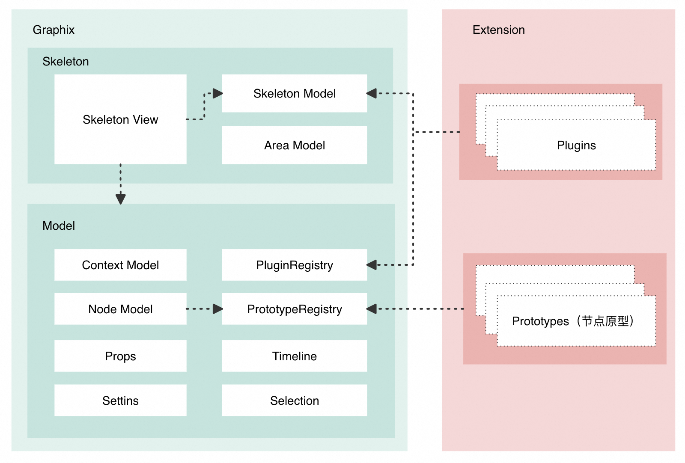

# Graphix
A lightweight, pluggable, object-oriented programming (OOP) style graphic editor development engine, designed to address the foundational architectural design issues in graphics editor development.

[简体中文](./README-zh_CN.md) | English

## 🎬 Demo
- [example-x6-bpms](./examples/x6-bpms/)

- [example-threejs-3d](./examples/threejs-3d)


## ✨ Features
- 💡 Domain-Driven Design: An OOP-style editor domain model based on TypeScript, providing complete data service support, including undo/redo mechanisms and selection management, among other features.
- 🎨 User Interface: Offers a highly customizable, responsive view framework called Skeleton View, tailored to meet diverse interface requirements.
- 🧩 Extensible Architecture: A plugin-based architecture allows for seamless expansion of editor capabilities without the need to alter any core code, making the addition of functions more flexible and convenient.

## 🔍 Glossary
| Term              | Description                                                  |
| ----------------- | ------------------------------------------------------------ |
| Skeleton          | Topbar, Toolbar, MainArea, LeftArea, RightArea  |
| Plugin            | Typically used to extend the display of various panels in the editor |
| Prototype         | Description of node prototypes, used to describe the view, attribute setters, default attribute values, etc. for different types of graphic nodes in the editor |
| Setting          | Used to describe how to configure the properties of graphic nodes    |
| Rendering Engine  | Used for rendering the graphic canvas in the central area, common 2D/3D rendering libraries: three.js, babylon.js, reactflow, d3, etc. |

## 📚 Design
```ts
GraphView = GraphRender(GraphixModel)
```
Graphix is designed based on reactive data-driven frameworks, ensuring that changes in the model can directly guide the rendering process of the graphical view. In short, the GraphView is dynamically generated by the GraphRender according to the state of the Graphix model. Once this model-to-rendering binding is established, the logic of graphical interaction becomes pure and efficient — there is no need to delve into complicated rendering logic, but instead, focus on the operations of the model itself. For example, to update a node name, developers only need to adjust the attribute values of the Graphix node. In this collaborative environment, even developers unfamiliar with graphic rendering can easily participate.

The core concept is to transform complex graphic rendering logic into simple model data structure problems, thereby providing a basic architectural design method for editors around the model.


### Editor Model
The editor model in Graphix is node-based, whether it's nodes/edges in 2D scenes or Object3D like Mesh in 3D, they are all abstractly described as a node in Graphix. The data structure of a Graphix node is also simple: Id, type, and corresponding node attributes (Props) make up a node.

```typescript
interface NodeData {
  id?: string;
  type: string;
  props?: PropsData;
  key: string: any;
}
```
Once the node-based design tone is set, the Graphix model layer can provide many node-based capabilities:
1. Timeline can provide undo and redo services for overall model changes.
2. Selection can manage the selection of nodes.
3. Prototype can be used to describe the visual representation, attribute configuration interface, and default attribute values of different types of graphic nodes. For example, in a Bpms process designer, the UserTask (manual approval) node, as a specific type, its prototype not only determines the node's visual presentation but also specifies the configuration items in the property settings panel when the user selects the node and the default attribute set of that node type. These descriptive pieces of information are highly generalizable, providing a unified definition framework for different types of graphic nodes.
4. ...and more

### Skeleton UI
The overall UI design of most editors is basically the same, typically including a Topbar, Toolbar, MainArea for the central canvas, RightArea for the right-side settings panel, etc. Graphix Skeleton views are responsive and extendable; panels can be added through the skeleton singleton.
```ts
import { skeleton } from 'graphix-engine';
skeleton.add({
  area: 'topbar',
  content: <div>A very cool title</div>
});
```

### Plugin
The design of plugins is very lightweight, and their role is more about providing a better way to organize code. When an editor product developed based on Graphix needs to provide extensibility to third parties, encapsulating with plugins can be very practical.
```ts
import { pluginRegistry } from 'graphix-engine';
pluginRegistry.register(() => {
  return {
    name: 'haha-plugin',
    init() {
      console.log('haha')
    }
  }
});
```

### JSON Schema
The essence of a graphic editor is editing JSON Schema in a visual way.
The default Schema of Graphix is as follows, which can be converted into the required structure according to the business scenario.
```json
{
  "id": "d94bc0d46131c",
  "type": "Demo",
  "version": "1.0.0",
  "props": {},
  "nodes": [
    {
      "id": "1",
      "type": "mesh",
      "props": {
        "position": { "x": -20, "y": 0, "z": 20 },
        "size": { "width": 10, "height": 10, "depth": 10 }
      }
    }
  ]
}
```

## 🚀 Getting Started
### Startup
The initialization startup logic of Graphix only has three steps:

1. Parse the JSON schema used for initialization into an in-memory Graphix model instance.
2. Execute the init hook of registered plugins.
3. Render the skeleton UI.

```ts
import { init } from 'graphix-engine';
init({
  schema: {
    id: 'd94bc0d46131c',
    type: 'Demo',
    version: '1.0.0',
    props: {},
    nodes: [
      {
        id: '1',
        type: 'mesh',
        props: {
          position: { x: -20, y: 0, z: 20 },
          size: { width: 10, height: 10, depth: 10 }
        }
      }
    ]
  }
});
```

### Example
Graphix is independent of graphic rendering and can adapt to any required graphic rendering engine based on the scenario. Here is an example with [threejs](https://github.com/mrdoob/three.js).
```bash
npm install graphix-engine @types/three three --save-dev
```

```ts
// threejs scene.tsx
import React, { useCallback, useEffect, useRef } from 'react';
import * as THREE from 'three';
import { OrbitControls } from 'three/examples/jsm/controls/OrbitControls';
import { DragControls } from 'three/examples/jsm/controls/DragControls.js';
import { getContext } from 'graphix-engine';

const Scene = () => {
  const containerRef = useRef<HTMLDivElement>(null);
  const context = getContext();

  const init = useCallback((container) => {
    const scene = new THREE.Scene();
    const axesHelper = new THREE.AxesHelper(20);
    scene.add(axesHelper);

    const width = container.clientWidth;
    const height = container.clientHeight;

    const camera = new THREE.PerspectiveCamera(70, width / height, 0.1, 1000);
    camera.position.set(50, 50, 50);
    camera.lookAt(scene.position);

    const renderer = new THREE.WebGLRenderer({ antialias: true });
    renderer.setSize(width, height);
    container.appendChild(renderer.domElement);

    const controls = new OrbitControls(camera, renderer.domElement);
    controls.enableDamping = true;
    controls.dampingFactor = 0.25;
    controls.enableZoom = true;

    const nodes = context.getNodes();
    const meshes = nodes.map(n => {
      const { position, size } = n.getPropsData();
      const geometry = new THREE.BoxGeometry(size.width, size.height, size.depth);
      const material = new THREE.MeshBasicMaterial({ color: 0xffffff, wireframe: true });
      const mesh = new THREE.Mesh(geometry, material);
      mesh.position.set(position.x, position.y, position.z);
      mesh.userData.gid = n.getId();
      scene.add(mesh);
      return mesh;
    });

    const ambientLight = new THREE.AmbientLight(0x404040);
    scene.add(ambientLight);

    const dragControls = new DragControls(meshes, camera, renderer.domElement);
    dragControls.addEventListener('dragstart', (event) => controls.enabled = false);
    dragControls.addEventListener('dragend', (event) => controls.enabled = true);

    const raycaster = new THREE.Raycaster();
    const onMouseDown = (event: MouseEvent) => {
      const mouse = new THREE.Vector2();
      const rect = renderer.domElement.getBoundingClientRect();
      mouse.x = ((event.clientX - rect.left) / rect.width) * 2 - 1;
      mouse.y = -((event.clientY - rect.top) / rect.height) * 2 + 1;
      raycaster.setFromCamera(mouse, camera);

      let selected;
      for (const mesh of meshes) {
        const intersects = raycaster.intersectObject(mesh);
        if (intersects.length > 0) {
          selected = intersects[0].object;
          break;
        }
      }
      onSelect(selected);
    };

    const onSelect = (object?: THREE.Object3D) => {
      console.log("Selected object:", object);
      if (object) {
        context.getSelection().setKeys([object.userData.gid]);
      } else {
        context.getSelection().setKeys([]);
      }
    };
    container.addEventListener('mousedown', onMouseDown);
    const animate = () => {
      requestAnimationFrame(animate);
      controls.update();
      renderer.render(scene, camera);
    };
    animate();
    return () => {
      container.removeEventListener('mousedown', onMouseDown);
    };
  }, []);

  useEffect(() => {
    if (containerRef.current) {
      const dispose = init(containerRef.current);
      return dispose;
    }
  }, [init]);

  return (
    <div style={{ width: '100%', height: '100%' }} ref={containerRef} />
  );
};

export default Scene;
```
```ts
// index.ts
import { init, prototypeRegistry, skeleton } from 'graphix-engine';
import Scene from './scene';
import InputSetter from './setter/input-setter';

// 配置 mesh 类型节点设置器
prototypeRegistry.register({
  type: 'mesh',
  settings: [
    {
      target: 'data',
      setter: InputSetter
    }
  ]
});

skeleton.add({
  area: 'mainArea',
  content: Scene
});

init({
  schema: {
    id: 'd94bc0d46131c',
    type: 'Demo',
    version: '1.0.0',
    // 全局属性
    props: {},
    // 节点集合
    nodes: [
      {
        id: '1',
        type: 'mesh',
        props: {
          position: { x: -20, y: 0, z: 20 },
          size: { width: 10, height: 10, depth: 10 },
          data: 1
        },
      },
      {
        id: '2',
        type: 'mesh',
        props: {
          position: { x: 0, y: 0, z: 0 },
          size: { width: 10, height: 10, depth: 10 },
          data: 2
        },
      },
      {
        id: '3',
        type: 'mesh',
        props: {
          position: { x: 20, y: 0, z: -20 },
          size: { width: 10, height: 10, depth: 10 },
          data: '3'
        },
      },
    ],
  }
});
```

## 💻 Local Development

```bash
$ npm install
$ npm run bootstrap

// Choose the appropriate demo to start
$ npm run example-x6-bpms
$ npm run example-three
$ npm run example-reactflow
```

## 👥 Contributing

We welcome all forms of contribution, whether it's new features, bug fixes, documentation improvements or other types of updates.

Strongly recommend reading [《The Wisdom of Asking Questions》](https://github.com/ryanhanwu/How-To-Ask-Questions-The-Smart-Way), [《How to Ask Questions to the Open Source Community》](https://github.com/seajs/seajs/issues/545) and [《How to Report Bugs Effectively》](http://www.chiark.greenend.org.uk/%7Esgtatham/bugs-cn.html), [《How to Submit Unanswerable Questions to Open Source Projects》](https://zhuanlan.zhihu.com/p/25795393), better questions are easier to get help. 

Regarding submitting PRs:
Please set the target merge branch to develop, not main. The develop branch will be merged into the main branch after the official version is released.

## 📄 License

Graphix is released under the MIT License. For more details, please read the license file.
